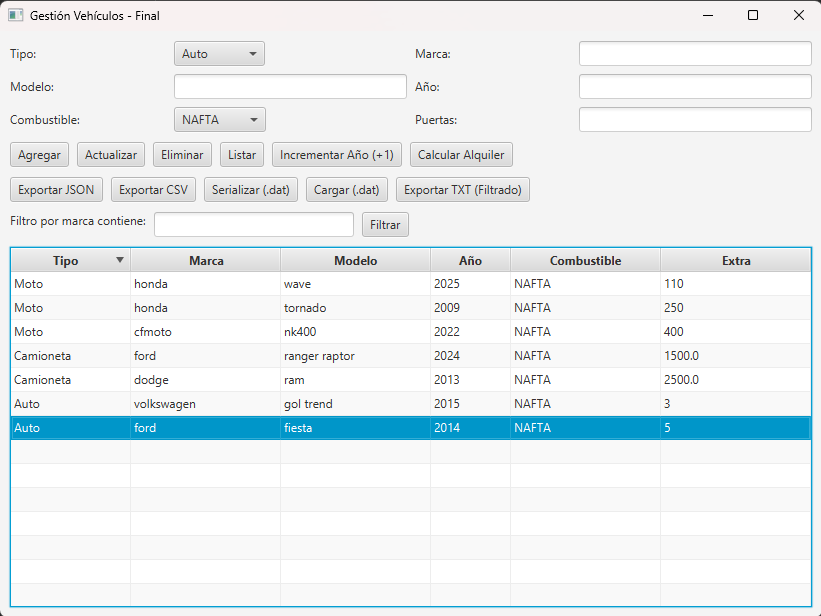
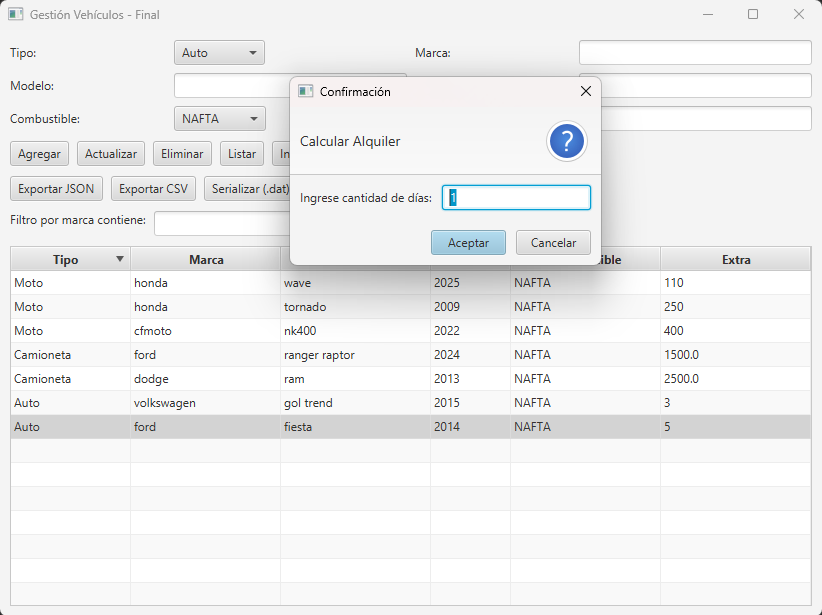
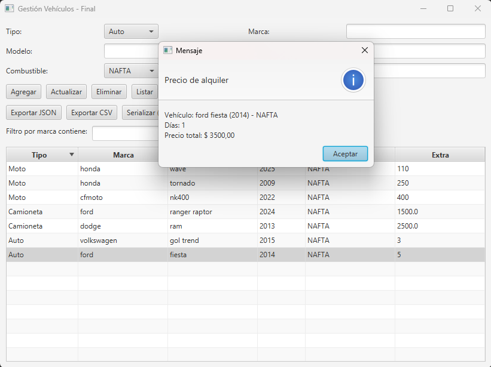
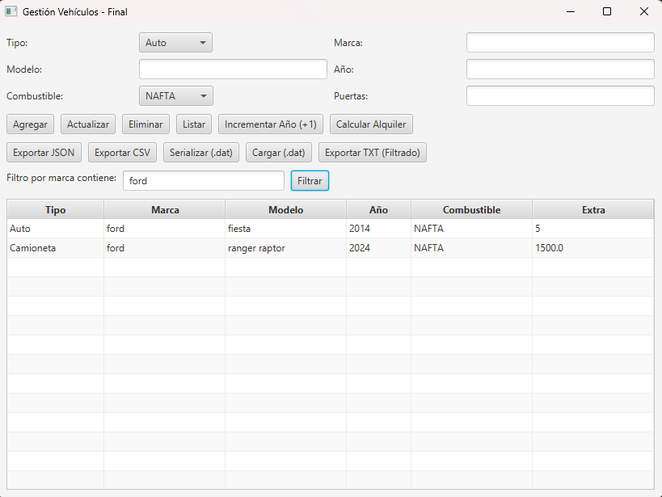

# Sistema de Gestión de Vehículos
# Sobre mí
Soy **Federico Lupo**, estudiante de la **Tecnicatura Universitaria en Programación, UTN Avellaneda**.  

Este proyecto fue desarrollado como trabajo final de la materia **Programación II**, aplicando Programación Orientada a Objetos, genéricos, persistencia y JavaFX.

# Resumen del Proyecto

Sistema de Gestión de Vehículos es una aplicación desarrollada en Java con **JavaFX** que permite gestionar vehículos de distintos tipos —**autos, motos y camionetas**— aplicando principios de **POO, interfaces, genéricos, colecciones y persistencia de datos**.

# Funcionalidades principales

- Alta, baja, modificación y listado de vehículos.  
- Ordenamiento por modelo o año.  
- Filtrado dinámico usando expresiones lambda.  
- Exportación de datos en formatos **CSV**, **JSON** y **TXT**.  
- Serialización binaria para guardar y recuperar el estado del sistema.  
- Cálculo de precio de alquiler (implementando la interfaz `IAlquilable`).  
- Interfaz gráfica intuitiva creada con **JavaFX**.  

# Capturas de pantalla
| Pantalla principal | Cálculo de alquiler |   Info alquiler    |      Filtrado      |
|--------------------|---------------------|--------------------|--------------------|
|  |  |  |  |

# Estructura y UML
**Diagrama de clases UML**


# **Descripción del diseño:**

- `Vehiculo` es una clase **abstracta base** que define atributos comunes (`marca`, `modelo`, `año`, `combustible`).
- `Auto`, `Moto` y `Camioneta` extienden de `Vehiculo` e implementan la interfaz `IAlquilable`.
- `GestionVehiculos<T extends Vehiculo>` maneja una lista genérica y aplica las operaciones CRUD, filtrado, ordenamiento y persistencia.
- `MainController` (JavaFX) gestiona los eventos de la vista e interactúa con `GestionVehiculos`.  
- Existen excepciones personalizadas: `ArchivoException` y `VehiculoNoEncontradoException`. 

# Archivos generados

|  Tipo  |                 Descripción                 |         Ejemplo           |
|--------|---------------------------------------------|---------------------------|
| `.dat` |   Archivo binario serializado del sistema   |      `vehiculos.dat`      |
| `.csv` |      Exportación legible de vehículos       |      `vehiculos.csv`      |
| `.json`|   Exportación estructurada en formato JSON  |      `vehiculos.json`     |
| `.txt` | Exportación filtrada legible para impresión | `vehiculos_filtrados.txt` |

# Tecnologías utilizadas

- **Java 21**
- **JavaFX 21**
- **Scene Builder**
- **NetBeans 21**
- **POO, Interfaces, Genéricos, Iterator, Lambda**
- **Archivos CSV / JSON / TXT / Binarios**

# Organización del Proyecto

```bash
📦 src/
 ┣ 📂 model/
 ┃ ┣ Vehiculo.java
 ┃ ┣ Auto.java
 ┃ ┣ Moto.java
 ┃ ┣ TipoCombustible.java
 ┃ ┗ Camioneta.java
 ┣ 📂 service/
 ┃ ┣ GestionVehiculos.java
 ┃ ┣ Comparators.java
 ┃ ┣ ICrud.java
 ┃ ┗ IAlquilable.java
 ┣ 📂 exceptions/
 ┃ ┣ ArchivoException.java
 ┃ ┗ VehiculoNoEncontradoException.java
 ┣ 📂 ui/
 ┃  ┣ App.java
 ┃  ┗ main_view.fxml
 ┣ 📂 ui/controllers/
 ┃  ┗ MainController.java
 ┗ 📂 util/
    ┗ CsvUtil.java
```
# Ejemplo de uso
Ejecutar la aplicación desde App.java.
Ingresar los datos del vehículo en los campos de texto.
Presionar Agregar para registrarlo.
Usar los botones de Ordenar, Filtrar, Exportar o Calcular Alquiler.
Guardar los datos con Serializar (.dat) o exportar a otros formatos.

# Licencia

Este proyecto fue desarrollado con fines académicos para la UTN Avellaneda - Programación II (2025).

# Autor

-Federico Lupo

-Año: 2025

-UTN - Facultad Regional Avellaneda
